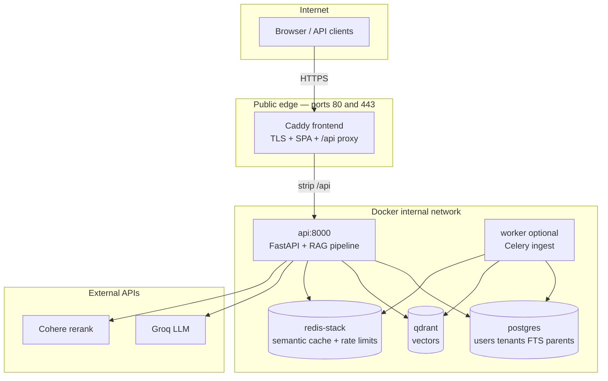

# Complete Project Guide — Architecture, Flow, and Production

This is the **single reference document** for the **advance-rag** (Quantitative Finance RAG) repository: what it does, how data moves, production topology, configuration, and operational checklists.

**Shorter entry points:** [START_HERE.md](START_HERE.md) (beginner), [DEPLOY.md](DEPLOY.md) (public HTTPS deploy), [CONTRIBUTING.md](CONTRIBUTING.md) (developers).

---

## Table of contents

1. [Project summary](#1-project-summary)
2. [Production architecture](#2-production-architecture)
3. [Local vs production deployment](#3-local-vs-production-deployment)
4. [Multi-tenant model](#4-multi-tenant-model)
5. [Ingestion flow (write path)](#5-ingestion-flow-write-path)
6. [Query / RAG flow (read path)](#6-query--rag-flow-read-path)
7. [Hybrid retrieval and RRF](#7-hybrid-retrieval-and-rrf)
8. [Semantic cache (Redis)](#8-semantic-cache-redis)
9. [Reranking and relevance floor](#9-reranking-and-relevance-floor)
10. [Generation and prompts](#10-generation-and-prompts)
11. [Metadata](#11-metadata)
12. [Authentication and API](#12-authentication-and-api)
13. [Configuration reference](#13-configuration-reference)
14. [Docker services and volumes](#14-docker-services-and-volumes)
15. [Scripts and operations](#15-scripts-and-operations)
16. [Testing and evaluation](#16-testing-and-evaluation)
17. [Source code map](#17-source-code-map)
18. [Production readiness checklist](#18-production-readiness-checklist)
19. [Troubleshooting](#19-troubleshooting)
20. [Glossary](#20-glossary)

---

## 1. Project summary

| Item | Description |
|------|-------------|
| **Purpose** | Multi-tenant **RAG** service: answer questions from **PDF corpora** with **grounded citations** |
| **Stack** | FastAPI, React, PostgreSQL, Qdrant, Redis Stack, Groq (LLM), Cohere (rerank) |
| **Ingestion** | Layout-aware PDF parsing → parent/child chunks → vector + keyword indexes |
| **Query** | Cache → hybrid search → parent expand → rerank → generate → optional faithfulness check |
| **Auth** | JWT (browser) + per-tenant API keys; Postgres required for multi-tenant production |
| **Tests** | 134+ pytest tests (unit/integration; external APIs stubbed in CI) |

**Golden rule:** Organization ID (`tenant_id`) must match across **ingest**, **login**, and **upload**.

---

## 2. Production architecture

Public traffic never hits the API port directly. One HTTPS entry serves the SPA and proxies `/api` internally.



### Traffic paths

| Path | Production |
|------|------------|
| User → UI | `https://SITE_DOMAIN/` → static React from Caddy |
| User → chat | `https://SITE_DOMAIN/api/chat/stream` → Caddy → `http://api:8000/chat/stream` |
| Integrations | Same host `/api/...` with `X-API-Key` or Bearer JWT |
| API :8000 on host | **Not published** in production `docker-compose.yml` |

### Data persistence (Docker volumes)

| Volume | Contents |
|--------|----------|
| `pg_data` | Tenants, users, FTS child chunks, parent documents |
| `qdrant_data` | Embedding vectors |
| `redis_data` | Cache entries + rate-limit keys |
| `rag_data` | Manifest, legacy pickle paths, doc_store mount |

---

## 3. Local vs production deployment

| Aspect | Local development | Production |
|--------|-------------------|------------|
| Compose | `docker compose -f docker-compose.yml -f docker-compose.dev.yml up -d` | `docker compose up -d` |
| API port | Published `8000` (dev overlay) | Internal only |
| Postgres / Qdrant / Redis ports | Published (dev overlay) | Internal only |
| TLS | HTTP `:80` if `SITE_DOMAIN` empty | `SITE_DOMAIN` + `CADDY_EMAIL` → Let's Encrypt |
| Secrets | `.env` from `.env.example` OK for dev | `setup_production_env.py`, `APP_ENV=production` |
| Signup | Often `PUBLIC_SIGNUP_ENABLED=true` | Usually false; admin creates tenants |

**Production setup (summary):**

```powershell
python scripts/setup_production_env.py --domain app.example.com --email ops@example.com --force
python scripts/verify_production_env.py
docker compose up -d --build
docker compose --profile tools up -d worker
```

See [DEPLOY.md](DEPLOY.md) for DNS, firewall, and first tenant.

---

## 4. Multi-tenant model

```text
Organization (tenant)
  ├── id          slug e.g. acme-insurance  (Organization ID in UI)
  ├── name, plan
  ├── api_key_hash   (integrations)
  ├── custom_instructions   (optional LLM tone)
  └── prompt_pack_id        (optional prompt JSON override)

User
  ├── email + password (bcrypt)
  └── belongs to exactly one tenant_id

Indexed data
  ├── child_chunks_fts   filtered by tenant_id
  ├── parent_documents   filtered by tenant_id
  └── Qdrant payloads    scoped via docstore + tenant
```

**Isolation:** Every search and ingest operation uses `tenant_id` from JWT or API key. Cross-tenant reads are prevented at the database and pipeline level.

---

## 5. Ingestion flow (write path)

```text
PDF (real_pdfs/ or upload)
  │
  ▼
DeepDocLoader (pymupdf4llm + layout)  →  one Document per page
  │   metadata: source (filename), page
  │
  ▼
+ tenant_id on each page
  │
  ▼
ParentDocumentRetriever.add_documents()
  ├── Parent sections  → Postgres parent_documents (or local pickle store)
  └── Child chunks     → embedded → Qdrant collection
  │
  ▼
Same child chunks  → Postgres child_chunks_fts (English to_tsvector + GIN)
  │
  ▼
Ingestion manifest (hash per file, skip unchanged on re-run)
```

**Entry points:**

| Method | Command / route |
|--------|-----------------|
| Batch CLI | `python scripts/ingest.py --tenant-id ORG --limit N` |
| Docker | `docker compose --profile tools run --rm ingest --tenant-id ORG` |
| Upload | `POST /documents/upload` + Celery **worker** |

**Chunk settings:** `PARENT_CHUNK_SIZE`, `CHILD_CHUNK_SIZE`, `CHILD_CHUNK_OVERLAP` in `.env`.

---

## 6. Query / RAG flow (read path)

Detailed pipeline in `src/core/rag_pipeline.py`:

```text
POST /chat or /chat/stream
  │
  ├─ 1. Auth → TenantContext(tenant_id)
  │
  ├─ 2. Optional chat history → query rewrite (standalone question)
  │
  ├─ 3. Query guard (block injection / off-topic patterns)
  │
  ├─ 4. Semantic cache lookup (unless “comprehensive” query)
  │      HIT → return cached answer + sources (cached=true, cache_similarity)
  │
  ├─ 5. Hybrid retrieval (tenant-scoped)
  │
  ├─ 6. Resolve child → parent document (docstore)
  │
  ├─ 7. Deduplicate passages (hash source|page|content prefix)
  │
  ├─ 8. Cap candidates → Cohere rerank → relevance_score
  │
  ├─ 9. Relevance floor (RERANK_MIN_SCORE) + entity-name relaxation
  │      Empty → NO_RELEVANT_PASSAGE_ANSWER (no LLM call)
  │
  ├─ 10. build_system_prompt() → Groq generation
  │
  ├─ 11. Strip <thinking> tags from output
  │
  ├─ 12. Optional faithfulness guard (entailment check)
  │
  ├─ 13. Build sources[] for API; cache.set on success (non-comprehensive)
  │
  └─ 14. Response: answer, sources, confidence_score, prompt_pack_version, ...
```

**Stream order:** `sources` event → `token` events → `done`.

---

## 7. Hybrid retrieval and RRF

Two retrievers run in parallel and fuse with **weighted reciprocal rank fusion (RRF)** via LangChain `EnsembleRetriever`:

| Retriever | Default weight | Implementation (Postgres mode) |
|-----------|----------------|--------------------------------|
| Keyword | **0.4** | `PostgresBM25Retriever` — `ts_rank` + ILIKE fallback for names |
| Dense | **0.6** | Qdrant via `ParentDocumentRetriever` |

Config: `ENSEMBLE_WEIGHTS=0.4,0.6`, `BM25_K=8`, `VECTOR_K=8`, `VECTOR_FETCH_K=20`.

**RRF is not the final rank:** Cohere **cross-encoder rerank** re-orders fused candidates afterward.

If keyword index is missing, hybrid degrades to **dense-only** (logged; `/health/ready` reports `bm25` optional failure).

---

## 8. Semantic cache (Redis)

**Purpose:** Skip retrieval + LLM when a **semantically similar** question was answered recently.

**Requirements:** `redis/redis-stack-server` (vector index), not plain Redis.

### How similarity is decided

1. Build **scoped query string:**  
   `prompt:<hash>\n` + user question  
   (hash includes prompt pack version, tenant_id, org instructions, platform `RAG_PERSONA`).

2. **Embed** with the **same model** as retrieval (`EMBEDDING_MODEL`, default `BAAI/bge-small-en-v1.5`, 384-d).

3. **Redis HNSW KNN** (cosine) over stored past query vectors (`SEMANTIC_CACHE_MAX_CANDIDATES`, default **3**).

4. For each neighbor: `similarity = 1.0 - cosine_distance`.

5. **Cache HIT** if `similarity >= SEMANTIC_CACHE_THRESHOLD` (default **0.88**).

6. On hit, return stored **answer** + **sources**; API sets `cached: true`, `cache_similarity`.

### Cache write

After successful generation (not declined, not comprehensive-only path rules): store query text, vector, answer, sources JSON; TTL `SEMANTIC_CACHE_TTL_SECONDS` (default **86400** s).

### Cache bypass

Queries classified as **comprehensive / list / compare** (`wants_comprehensive_answer`) skip cache read and often skip cache write.

Redis failure → **fail open** (full RAG every time).

---

## 9. Reranking and relevance floor

| Stage | Setting | Default in code | `.env.example` |
|-------|---------|-----------------|----------------|
| Cohere model | `RERANK_MODEL` | rerank-v3.5 | rerank-v3.5 |
| Max docs to rerank | `RERANK_MAX_CANDIDATES` | 40 | — |
| Min score to cite | `RERANK_MIN_SCORE` | **0.50** | **0.30** |

Passages with `relevance_score < floor` are dropped.

**Entity relaxation:** If nothing passes the floor but passages match **entity tokens** from the query (e.g. surname in `source` filename), keep top name-matched chunks (for person/resume queries with low Cohere scores).

---

## 10. Generation and prompts

Static one-line system prompts were replaced by **per-request assembly** (`src/core/prompt_builder.py`):

| Layer | Source |
|-------|--------|
| Grounding + persona + style | `src/core/prompts/{PROMPT_PACK_ID}.json` (version field inside JSON) |
| Query intent | Rules: concise, comprehensive, list, compare, summarize |
| Corpus profile | Inferred from retrieved chunks (research / resume / policy / general) or `document_type` metadata |
| Platform | `RAG_PERSONA` env |
| Organization | `tenants.custom_instructions` in Postgres |

Response field: **`prompt_pack_version`** e.g. `default@1.0.0`.

**Groq:** `GROQ_MODEL_NAME` (default `openai/gpt-oss-120b`). Context includes `[Source: file, page N]` blocks.

**Faithfulness:** Optional post-check (`ENABLE_FAITHFULNESS_GUARD=true`); failure returns guard message without citing weak sources.

---

## 11. Metadata

### Stored at ingest (per chunk)

| Field | Meaning |
|-------|---------|
| `source` | PDF filename |
| `page` | Page number |
| `tenant_id` | Organization |
| `doc_id` | Link child → parent section |
| `document_type` / `doc_type` | Optional: resume, policy, research, general |

Postgres FTS row: `tenant_id`, `source`, `page`, `content`, `metadata_json` (full dict), `tsv`.

### Added at query time (not persisted in DB)

| Field | Set by |
|-------|--------|
| `retriever` | postgres_fts, postgres_ilike, vector path |
| `bm25_score` | FTS rank or ILIKE fallback |
| `relevance_score` | Cohere rerank |

### API citations

`source`, `page`, `score` (rerank), `snippet` (first 300 chars).

---

## 12. Authentication and API

| Client | Header | Resolves to |
|--------|--------|-------------|
| Browser | `Authorization: Bearer <JWT>` | user + tenant |
| Integration | `X-API-Key: <key>` | tenant from hash in DB |
| Admin | `X-Admin-Key` | `/admin/*`, `/auth/register` |

With `DATABASE_URL` set, **unauthenticated requests are rejected** (no anonymous tenant).

**Main routes:**

| Route | Purpose |
|-------|---------|
| `POST /auth/login`, `/auth/signup` | JWT session |
| `GET /tenants/me` | Current user + org |
| `POST /chat`, `/chat/stream` | RAG answer |
| `POST /documents/upload` | Queue PDF (needs worker) |
| `GET /health/ready`, `/health/live` | Ops |
| `GET /metrics` | Prometheus |

Rate limit: `RATE_LIMIT_PER_MINUTE` (default 30) per identity via Redis.

---

## 13. Configuration reference

Copy [`.env.example`](.env.example) → `.env`. Key groups:

| Group | Important variables |
|-------|---------------------|
| Providers | `GROQ_API_KEY`, `COHERE_API_KEY` |
| Auth | `JWT_SECRET`, `ADMIN_API_KEY`, `PUBLIC_SIGNUP_ENABLED` |
| Production | `APP_ENV=production`, `SITE_DOMAIN`, `CADDY_EMAIL`, `CORS_ORIGINS` |
| Postgres | `POSTGRES_*`; compose builds `DATABASE_URL` inside containers |
| Qdrant | `QDRANT_URL`, `QDRANT_COLLECTION_NAME` |
| Retrieval | `ENSEMBLE_WEIGHTS`, `BM25_K`, `VECTOR_K`, `RERANK_MIN_SCORE` |
| Cache | `SEMANTIC_CACHE_ENABLED`, `SEMANTIC_CACHE_THRESHOLD=0.88` |
| Prompts | `PROMPT_PACK_ID`, `RAG_PERSONA` |

**Production validation:** With `APP_ENV=production`, API startup fails if secrets, domain, email, or provider keys are weak/missing (see `src/config/production_guard.py`).

---

## 14. Docker services and volumes

| Service | Role | Prod host ports |
|---------|------|-----------------|
| `frontend` | Caddy + SPA | 80, 443 |
| `api` | RAG API | none |
| `postgres` | DB + FTS | none |
| `qdrant` | Vectors | none |
| `redis` | Cache + limits | none |
| `ingest` | One-shot ingest (profile `tools`) | — |
| `worker` | Celery uploads (profile `tools`) | — |

---

## 15. Scripts and operations

| Script | Use |
|--------|-----|
| `scripts/ingest.py` | Bulk index PDFs |
| `scripts/manage_tenants.py` | create / add-user / set-prompt / rotate-key |
| `scripts/setup_production_env.py` | Generate production `.env` |
| `scripts/verify_production_env.py` | Pre-flight validation |
| `scripts/deploy_production.ps1` | Windows one-shot deploy |
| `scripts/debug_retrieval.py` | Debug search per tenant |

Details: [scripts/README.md](scripts/README.md).

---

## 16. Testing and evaluation

| Layer | What runs | Golden dataset |
|-------|-----------|----------------|
| **pytest** (`pytest -q`) | 134+ unit/API tests; mocks for external services | N/A |
| **CI** (GitHub Actions) | Ruff, mypy, pytest, Docker build | N/A |
| **`tests/eval/run_eval.py`** | Offline **recall@k**, **MRR**, rerank lift | Needs `golden_queries.json` (gitignored) |
| **`tests/eval/eval_harness.py`** | Chunking, retrieval, generation signals, latency | Same; template only in repo |

**Not done as release gate:** Full precision@k, generation vs reference answers, CI eval on every PR. Template: `tests/eval/golden_queries_template.json`.

---

## 17. Source code map

| Path | Responsibility |
|------|----------------|
| `src/api/main.py`, `routes.py`, `deps.py`, `jwt_auth.py` | HTTP + auth |
| `src/core/rag_pipeline.py` | End-to-end orchestration |
| `src/core/prompt_builder.py`, `prompt_loader.py`, `prompts/*.json` | Dynamic prompts |
| `src/core/query_guard.py`, `faithfulness_guard.py` | Safety |
| `src/retrieval/hybrid_search.py` | RRF fusion |
| `src/db/pg_bm25.py`, `postgres_store.py`, `schema.py` | Postgres FTS + parents |
| `src/retrieval/vector_store.py` | Qdrant + embeddings |
| `src/cache/semantic_cache.py` | Redis semantic cache |
| `src/llm/generator.py`, `reranker.py` | Groq + Cohere |
| `src/ingestion/chunker.py`, `deepdoc_loader.py`, `tasks.py` | Ingest |
| `frontend/src/App.jsx` | Login + chat UI |

---

## 18. Production readiness checklist

**Product features:** Implemented (RAG, tenants, auth, upload, prompts, Docker, guards).

**Before public launch:**

- [ ] DNS A record → server; ports **80/443** open  
- [ ] `setup_production_env.py` + `verify_production_env.py`  
- [ ] `APP_ENV=production`, strong `JWT_SECRET`, `ADMIN_API_KEY`, `POSTGRES_PASSWORD`  
- [ ] `GROQ_API_KEY`, `COHERE_API_KEY`  
- [ ] `docker compose up -d` (no dev port overlay)  
- [ ] `docker compose --profile tools up -d worker` if using uploads  
- [ ] Create tenant + ingest PDFs for that org  
- [ ] `curl https://YOUR_DOMAIN/api/health/ready`  
- [ ] Backup plan for `pg_data` and `qdrant_data`  

**Optional hardening:** Disable public signup; object storage for uploads; run eval harness after ingest; monitoring on `/metrics`.

---

## 19. Troubleshooting

| Symptom | Cause | Action |
|---------|-------|--------|
| No passage in corpus | Wrong tenant or no ingest | Match org id; run ingest |
| Low scores / empty after rerank | `RERANK_MIN_SCORE` too high | Lower to 0.30 in `.env` |
| Person name misses | FTS + low rerank | ILIKE fallback + entity relaxation; check filename |
| 401 | Missing JWT | Sign in |
| Cache always miss | Comprehensive phrasing | Expected; or lower threshold carefully |
| Upload stuck | No worker | Start Celery worker profile |
| Build DNS error | No Docker Hub | Fix network; see README |

---

## 20. Glossary

| Term | Definition |
|------|------------|
| **RAG** | Retrieve relevant text, then generate an answer grounded in it |
| **RRF** | Reciprocal rank fusion — merge ranked lists from two retrievers |
| **Tenant** | Organization; all data partitioned by `tenant_id` |
| **Child / parent chunk** | Small search unit vs larger context for the LLM |
| **FTS** | Postgres full-text search (keyword leg of hybrid) |
| **Semantic cache** | Redis vector similarity on **questions**, not documents |
| **MRR / recall@k** | Retrieval eval metrics in `tests/eval/` |

---

*Document version aligns with repository main branch (multi-tenant Postgres, JWT, versioned prompts, production compose). Update this file when architecture or env vars change.*
