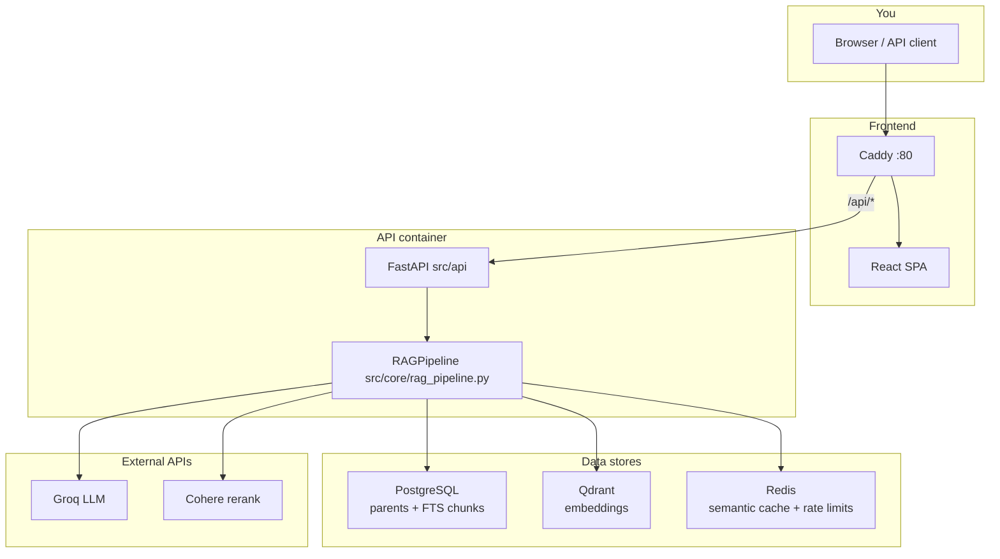

# Advance RAG — Complete Project Guide (Flow & Status)

This document explains **what the project is**, **whether it is “complete”**, and **how every part connects** from PDF upload to chat answer. Read this if you are new to the repo or unsure what to run next.

For install commands and environment variables, see [`README.md`](README.md) and [`.env.example`](.env.example).

---

## 1. Is the project complete?

**Yes, for a full working product:** ingestion, multi-tenant auth, hybrid search, reranking, grounded answers, web UI, Docker stack, and **126 automated tests** are implemented.

| Layer | What you have |
|--------|----------------|
| **Data** | PDF → chunks → **Qdrant** (vectors) + **PostgreSQL** (FTS keyword index + parent doc store) |
| **API** | FastAPI: `/chat`, `/chat/stream`, upload, auth, health, metrics |
| **Security** | JWT (browser) or `X-API-Key` (integrations); each user belongs to one **tenant**; data is isolated by `tenant_id` |
| **UI** | React app: sign in / sign up, streaming chat, citations |
| **Ops** | `docker compose up`, optional Celery worker for async uploads |

**Not “finished” in the sense of a large commercial SaaS:** you may still want better onboarding copy (which org has which docs), CI/CD, staging, backups, and keeping older docs (`RAG_PIPELINE.md`, parts of README) aligned with Postgres FTS. Those are polish and operations, not missing core features.

**Mental model:** The project is **complete as a RAG application**. Your job when using it is: **create tenant → ingest PDFs for that tenant → sign in as that tenant → ask questions.**

---

## 2. One-page picture



**Two lifecycles:**

1. **Ingestion (write path)** — PDFs become searchable rows/vectors **per tenant**.
2. **Query (read path)** — Question → retrieve → rerank → generate → answer + sources **for that tenant only**.

---

## 3. Docker services (what runs where)

Defined in [`docker-compose.yml`](docker-compose.yml):

| Service | Port (default) | Role |
|---------|----------------|------|
| **api** | 8000 | RAG + auth + upload API |
| **frontend** | 80 | SPA + reverse proxy `/api` → api |
| **postgres** | 5432 | Tenants, users, parent chunks, **FTS** child chunks |
| **qdrant** | 6333 | Vector search per collection |
| **redis** | 6379 | Semantic cache + rate limiting |
| **ingest** | (profile `tools`) | One-shot: `python scripts/ingest.py` |
| **worker** | (profile `tools`) | Celery: processes `/documents/upload` jobs |

**Typical first-time stack:**

```bash
cp .env.example .env   # add GROQ_API_KEY, COHERE_API_KEY, JWT_SECRET, etc.
docker compose -f docker-compose.yml -f docker-compose.dev.yml up -d --build
```

**Production (no public API port, TLS when configured):**

```bash
python scripts/setup_production_env.py --domain YOUR_DOMAIN --email YOU@example.com --force
# Set SITE_DOMAIN, CADDY_EMAIL, CORS_ORIGINS, APP_ENV=production, provider keys
docker compose up -d --build
```

**Ingest demo PDFs into a tenant:**

```bash
docker compose --profile tools run --rm ingest --tenant-id acme-insurance --limit 10
```

**Async uploads from the UI** need the worker:

```bash
docker compose --profile tools up -d worker
```

---

## 4. Multi-tenant model (critical to understand)

Everything indexed is tagged with a **`tenant_id`** (organization id), for example `acme-insurance`.

| Concept | Where it lives |
|---------|----------------|
| Organization | `tenants` table in Postgres |
| User (email/password) | `users` table, linked to one tenant |
| API key (integrations) | Stored hashed per tenant; rotated via admin |
| Search indexes | Qdrant + `child_chunks_fts` + parent store — **filtered by `tenant_id`** |

**If you sign up with a new organization id**, you get an **empty** corpus until you ingest or upload PDFs **for that tenant**.  
Demo resume data for “Harshal Zarikar” is only under **`acme-insurance`** unless you uploaded it elsewhere.

**Auth resolution** ([`src/api/deps.py`](src/api/deps.py)):

1. `Authorization: Bearer <JWT>` → user + tenant from token (web app).
2. `X-API-Key: <key>` → tenant from key (scripts, integrations).
3. If `DATABASE_URL` is set, anonymous access is **not** allowed.

**CLI setup** ([`scripts/manage_tenants.py`](scripts/manage_tenants.py)):

```bash
python scripts/manage_tenants.py create --id acme-insurance --name "Acme Insurance" --plan pro
python scripts/manage_tenants.py add-user --tenant acme-insurance --email analyst@acme.com --password 'YourPassword!'
```

**Web self-service:** `POST /auth/signup` (when `PUBLIC_SIGNUP_ENABLED=true`) — user picks org id (new or existing per your rules).

---

## 5. Authentication & session flow (browser)

```text
User opens frontend (port 80 or Vite dev on 5173)
    │
    ├─ Sign in  → POST /api/auth/login  { email, password }
    │              ← { access_token, tenant, user }
    │
    └─ Sign up  → POST /api/auth/signup { email, password, tenant_id, ... }
                   ← same shape as login

Frontend stores JWT in localStorage
    │
    └─ Every chat request:
         POST /api/chat/stream
         Header: Authorization: Bearer <token>

API authorize() decodes JWT → TenantContext(tenant_id=...)
    │
    └─ get_pipeline(tenant_id) → hybrid search scoped to that tenant
```

**Check who you are:** `GET /api/tenants/me` with the same Bearer token.

---

## 6. Ingestion flow (PDF → indexes)

### 6.1 Entry points

| Method | When to use |
|--------|-------------|
| **`scripts/ingest.py`** | Bulk ingest from `real_pdfs/` (CLI or Docker `ingest` service) |
| **`POST /documents/upload`** | Single PDF from UI; needs **Celery worker** + Redis |
| **Celery task** `ingest_pdf` | Same pipeline as ingest script, one file |

### 6.2 Steps inside ingestion

```text
PDF file
  │
  ▼
DeepDoc-style loader (pymupdf4llm + layout models)
  │  (fallback: plain text extract)
  ▼
Markdown-ish text per page
  │
  ├─ Parent split  (headings / large sections)
  │     └─► Postgres or local doc store  (keyed by doc_id, tenant_id)
  │
  └─ Child split   (~700 chars, overlap)
        ├─► Embeddings ──► Qdrant  (tenant-scoped collection)
        └─► Text rows  ──► Postgres child_chunks_fts  (to_tsvector + tenant_id)
```

**Manifest** (`INGESTION_MANIFEST_FILE`): tracks file hashes so re-runs skip unchanged PDFs. Use `--reset` after chunking/parser changes.

**Important:** With **`DATABASE_URL`** set (Docker default), keyword search uses **`PostgresBM25Retriever`** ([`src/db/pg_bm25.py`](src/db/pg_bm25.py)), not the old `bm25_index.pkl` alone. The pickle path remains for local dev without Postgres.

**Rare names (e.g. people):** English FTS may miss them; the retriever runs an **ILIKE fallback** on `content` and `source` (filename).

### 6.3 Commands you will actually run

```bash
# Docker — ingest 10 PDFs for one tenant
docker compose --profile tools run --rm ingest --tenant-id acme-insurance --limit 10

# Local venv — same script
python scripts/ingest.py --tenant-id acme-insurance --limit 5
python scripts/ingest.py --verify
```

After ingestion, **no API restart is required** for Postgres FTS (data is in the DB). Qdrant and docstore read live data on each query.

---

## 7. Query flow (question → answer)

Entry: [`src/core/rag_pipeline.py`](src/core/rag_pipeline.py) — method `run()` / `stream()`.

### 7.1 Step-by-step

```text
1. Query rewrite (optional, uses chat_history)

2. Query guard — block unsafe / off-topic queries
      └─► blocked message, no retrieval

3. Semantic cache (Redis) — skip for "comprehensive" / detail-style queries
      └─► cache HIT → return stored answer + sources

4. Hybrid retrieval (tenant-scoped)
      ├─ Postgres FTS (BM25-like)     weight ~0.4
      └─ Qdrant dense search          weight ~0.6
      └─ EnsembleRetriever fuses ranks

5. Parent resolution — child hit → larger parent section (docstore)

6. Deduplicate passages

7. Cohere rerank — relevance_score on each doc

8. Relevance floor (RERANK_MIN_SCORE)
      └─ drop low scores
      └─ entity-name relaxation: if query looks like a person/name search
          and filename/body matches tokens, keep top matches anyway

9. If zero passages left → NO_RELEVANT_PASSAGE_ANSWER (no LLM call)

10. Dynamic system prompt — build_system_prompt() in prompt_builder.py
      (intent: list, compare, comprehensive, resume vs research, etc.)

11. Groq generation — answer must use [Source: ...] labels

12. Faithfulness guard (optional) — reject answer if not supported by context

13. Return answer + sources (file, page, score, snippet)
      └─ cache store (unless comprehensive query)
```

### 7.2 HTTP mapping

| Endpoint | Behavior |
|----------|----------|
| `POST /chat` | Full JSON response |
| `POST /chat/stream` | SSE: `sources` → `token`… → `done` |
| `GET /health/ready` | Qdrant, Redis, DB, keys — may be `degraded` |
| `GET /metrics` | Prometheus |

Pipeline is created per tenant: [`get_rag_pipeline(tenant_id)`](src/core/rag_pipeline.py).

---

## 8. Frontend flow

Source: [`frontend/src/App.jsx`](frontend/src/App.jsx).

```text
Load app
  ├─ No token → Auth screen (Sign in | Create account)
  │     Organization ID field = tenant_id
  │
  └─ Token present → Chat UI
        ├─ Shows tenant name/id from /tenants/me
        ├─ User types question
        └─ streamAnswer() → POST /chat/stream
              ├─ Render citations when type=sources
              ├─ Append tokens when type=token
              └─ Stop spinner on type=done
```

Dev: `cd frontend && npm run dev` (proxies API to port 8000 by default).  
Production-like: use Docker **frontend** on port 80.

---

## 9. Key source files (map of the repo)

| Path | Responsibility |
|------|----------------|
| `src/api/main.py` | App factory, CORS, router mount |
| `src/api/routes.py` | Chat, auth, upload, admin, health |
| `src/api/deps.py` | JWT / API key, rate limit, tenant context |
| `src/api/jwt_auth.py` | Token create/verify |
| `src/core/rag_pipeline.py` | End-to-end RAG orchestration |
| `src/core/prompt_builder.py` | Per-query system prompt |
| `src/core/query_guard.py` | Safety filter |
| `src/core/faithfulness_guard.py` | Post-generation check |
| `src/retrieval/hybrid_search.py` | FTS + vector fusion |
| `src/retrieval/vector_store.py` | Qdrant + parent retriever |
| `src/db/pg_bm25.py` | Postgres FTS + ILIKE fallback |
| `src/db/postgres_store.py` | Parent document store |
| `src/db/tenant_store.py` / `user_store.py` | Orgs and users |
| `src/cache/semantic_cache.py` | Redis vector cache |
| `src/ingestion/chunker.py` | Parent/child splitting |
| `src/ingestion/tasks.py` | Celery ingest jobs |
| `scripts/ingest.py` | Batch ingestion CLI |
| `scripts/manage_tenants.py` | Tenant/user CLI |

---

## 10. End-to-end checklist (follow this order)

Use this as a **lab script** to prove the project works.

1. **Configure** — Copy `.env.example` → `.env`; set at minimum:
   - `GROQ_API_KEY`, `COHERE_API_KEY`
   - `JWT_SECRET` (long random string)
   - `DATABASE_URL` (compose sets this inside containers)

2. **Start stack** — `docker compose up -d --build`

3. **Create tenant + user** (if not using signup):
   ```bash
   python scripts/manage_tenants.py create --id acme-insurance --name "Acme Insurance"
   python scripts/manage_tenants.py add-user --tenant acme-insurance --email you@example.com --password 'SecurePass123!'
   ```

4. **Ingest documents** for that **same** tenant id:
   ```bash
   docker compose --profile tools run --rm ingest --tenant-id acme-insurance --limit 5
   ```

5. **Open UI** — http://localhost (or frontend port). Sign in with your user; confirm **Organization** matches step 3.

6. **Ask a question** that exists in the PDFs — you should see **sources** and an answer.

7. **Optional** — Run tests: `pytest tests` (expect ~126 passed).

---

## 11. Common problems

| Symptom | Likely cause | Fix |
|---------|----------------|-----|
| “No passage in the indexed corpus…” | Wrong **tenant** or nothing ingested | Sign in to org that has data; ingest/upload for your org |
| Same as above, but data exists | Rerank scores below `RERANK_MIN_SCORE` | Lower to `0.30` in `.env`; entity queries have relaxation for name matches |
| Person name not found | FTS ignores rare tokens | ILIKE fallback + query with surname; ensure PDF filename or text contains the name |
| Upload stays “queued” forever | Celery worker not running | `docker compose --profile tools up -d worker` |
| 401 on chat | Missing/expired JWT | Sign in again |
| `/health/ready` degraded | Missing API keys or Redis down | Check `.env` and `docker compose ps` |

Debug helper (stack running): `PYTHONPATH=. python scripts/debug_retrieval.py --query "..." --tenant acme-insurance`

---

## 12. How this relates to other docs

| Document | Use it for |
|----------|------------|
| [`README.md`](README.md) | Quick start, env vars, curl examples |
| [`SYSTEM_ARCHITECTURE.md`](SYSTEM_ARCHITECTURE.md) | Design rationale |
| [`RAG_PIPELINE.md`](RAG_PIPELINE.md) | Deeper retrieval notes (some paths mention pickle BM25; prefer this guide for Postgres) |
| **This file** | **Full flow, completeness, tenant + auth mental model** |

---

## 13. Prompt packs and versioning

Generation uses **layered prompts** (see `src/core/prompt_builder.py`):

| Layer | Where it lives | How to change |
|--------|----------------|---------------|
| Grounding + persona + style | `src/core/prompts/{id}.json` | Edit JSON, bump `"version"`, set `PROMPT_PACK_ID` |
| Platform tone | `RAG_PERSONA` in `.env` | Redeploy / reload env |
| Organization tone | Postgres `tenants.custom_instructions` | `python scripts/manage_tenants.py set-prompt --id …` |
| Per-org pack override | Postgres `tenants.prompt_pack_id` | Same CLI with `--pack` |

Chat responses include `prompt_pack_version` (e.g. `default@1.0.0`) for auditing. Semantic cache keys include the pack version and tenant instructions so prompt changes do not reuse stale answers.

---

## 14. Summary

- The project **is complete** as a **multi-tenant RAG service** with auth, ingestion, hybrid retrieval, reranking, guards, cache, UI, and tests.
- **Flow:** PDFs → ingest (per `tenant_id`) → Postgres + Qdrant → user logs in → API scopes retrieval to their tenant → pipeline returns grounded answer.
- **Your main responsibility when demoing:** always align **login organization**, **ingest `--tenant-id`**, and **upload tenant** so the chat sees the same data.

If you only remember one rule: **tenant id must match everywhere.**

To change how the model writes answers tomorrow: edit `src/core/prompts/default.json` (or add `v2.json`), bump `"version"`, optionally set `PROMPT_PACK_ID`, run tests, redeploy API. Per-customer wording goes in `set-prompt --instructions`.
