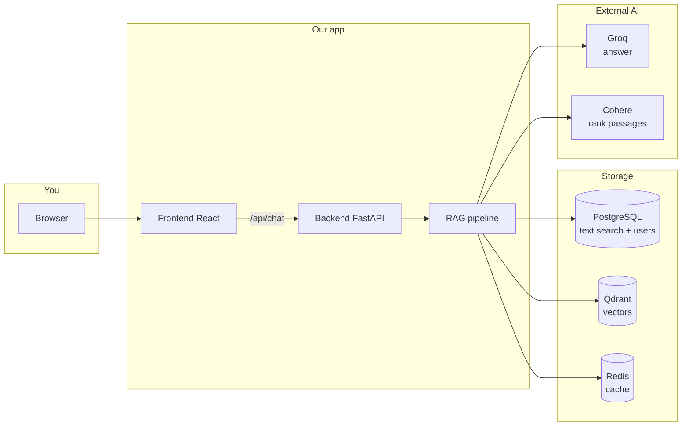

# START HERE — Understand This Project in One Place

Read this file first. Everything else in the repo is detail; **this is the story of the whole system**.

---

## 1. What is this project? (30 seconds)

This is a **chat app that answers questions using your PDF files**.

- You **upload or ingest PDFs** → they are stored and indexed.
- You **ask a question** in the browser → the system **finds relevant pages**, then an **AI writes an answer** using **only those pages** (with citations).
- **Many organizations** can use the same app without seeing each other’s data (**multi-tenant**).

Think: **“ChatGPT, but it only knows what is in your company’s documents.”**

---

## 2. The one rule that fixes most confusion

Every PDF and every question belongs to an **Organization ID** (also called **tenant id**).

Examples: `acme-insurance`, `my-company`.

| Step | Must use the **same** Organization ID |
|------|----------------------------------------|
| Ingest PDFs | `--tenant-id acme-insurance` |
| Sign up / Sign in | Organization field = `acme-insurance` |
| Upload PDF in UI | Automatic (uses your logged-in org) |

If you sign in as `my-company` but PDFs were ingested for `acme-insurance`, the chat will say **“no relevant passage”** — the data is not in your org.

---

## 3. Big picture (how pieces connect)



**Two main flows:**

1. **Write path (ingestion)** — PDF → chunks → PostgreSQL + Qdrant.  
2. **Read path (chat)** — question → search → rank → generate answer.

You must do **ingestion before chat** is useful.

---

## 4. What runs when you use Docker?

| Container | Plain English |
|-----------|----------------|
| **frontend** | Website you open in the browser; also forwards `/api` to the backend |
| **api** | Brain: auth, chat, upload |
| **postgres** | Users, organizations, document text for keyword search |
| **qdrant** | “Meaning” search (vectors) |
| **redis** | Remembers similar past questions (cache) |
| **worker** (optional) | Processes PDF uploads in the background |

**Local dev** (ports on your PC):

```powershell
docker compose -f docker-compose.yml -f docker-compose.dev.yml up -d
```

Open: http://localhost (site) or http://localhost:8000/health/ready (API health, dev only).

---

## 5. Folder map (what code lives where)

```text
advance-rag/
│
├── START_HERE.md          ← you are here
├── README.md              ← install commands
├── DEPLOY.md              ← public internet + HTTPS
├── CONTRIBUTING.md        ← for developers changing code
│
├── docker-compose.yml     ← production-style stack
├── docker-compose.dev.yml ← extra ports for local debugging
├── .env.example           ← copy to .env and fill keys
│
├── frontend/              ← React login + chat UI
│
├── src/                   ← Python backend
│   ├── api/               ← HTTP: /chat, /auth/login, upload
│   ├── core/              ← RAG pipeline + prompts + safety checks
│   ├── db/                ← Postgres: tenants, users, search index
│   ├── retrieval/         ← Combine keyword + vector search
│   ├── ingestion/         ← Split PDFs into chunks
│   ├── llm/               ← Call Groq and Cohere
│   └── cache/             ← Redis semantic cache
│
├── scripts/
│   ├── ingest.py          ← Bulk add PDFs from real_pdfs/
│   └── manage_tenants.py  ← Create org + user from command line
│
└── tests/                 ← Automated checks (134+ tests)
```

You **do not** need to read every file. For daily use, **frontend + scripts + .env** are enough.

---

## 6. First-time setup (copy-paste path)

### Step A — Config

```powershell
cd C:\Users\Asus\Documents\advance-rag
copy .env.example .env
```

Edit `.env` and set at least:

- `GROQ_API_KEY` — from Groq (generates answers)
- `COHERE_API_KEY` — from Cohere (ranks passages)
- `JWT_SECRET` — any long random string (login sessions)

### Step B — Start stack

```powershell
docker compose -f docker-compose.yml -f docker-compose.dev.yml up -d
```

Wait until healthy: `curl http://localhost:8000/health/ready`

### Step C — Create organization + user

```powershell
python scripts/manage_tenants.py create --id acme-insurance --name "Acme Insurance"
python scripts/manage_tenants.py add-user --tenant acme-insurance --email you@test.com --password "YourPass123!"
```

### Step D — Add PDFs to search

Put PDFs in `real_pdfs/` then:

```powershell
docker compose --profile tools run --rm ingest --tenant-id acme-insurance --limit 10
```

### Step E — Chat

1. Open http://localhost  
2. Sign in — **Organization ID:** `acme-insurance`, your email/password  
3. Ask a question that exists in the PDFs  

---

## 7. What happens when you send one chat message?

Order inside the backend (`src/core/rag_pipeline.py`):

```text
Your question
    │
    ├─ 1. Safety check (block bad prompts)
    │
    ├─ 2. Cache check (Redis) — skip for “detailed / list” questions
    │      └─ if similar question before → return old answer
    │
    ├─ 3. SEARCH (only YOUR tenant’s data)
    │      ├─ PostgreSQL: keyword search (names, numbers, terms)
    │      └─ Qdrant: meaning search (similar ideas)
    │      → merge both lists
    │
    ├─ 4. Expand small chunks → bigger parent sections
    │
    ├─ 5. Cohere rerank — score each passage vs your question
    │
    ├─ 6. Drop weak passages (relevance floor)
    │      └─ special case: person names in filename still kept
    │
    ├─ 7. If nothing left → “No passage in the indexed corpus…”
    │
    ├─ 8. Build system prompt (how long, what tone — from prompt JSON + query)
    │
    ├─ 9. Groq generates answer using ONLY retrieved text + [Source: …]
    │
    └─ 10. Optional faithfulness check → return answer + citations
```

The UI streams this via `POST /api/chat/stream`.

---

## 8. Authentication (simple)

| Who | How |
|-----|-----|
| **Human in browser** | Email + password → **JWT token** stored in browser |
| **Script / integration** | **X-API-Key** header (per organization) |

Without login (when Postgres is on), the API returns **401**.

**Sign up in UI** creates a user under the Organization ID you type (if signup is enabled).

---

## 9. Prompts (how the AI is instructed)

Not one fixed paragraph — built **per question**:

| Layer | Where | Purpose |
|-------|--------|---------|
| Base rules | `src/core/prompts/default.json` | “Only use context, cite sources” |
| Question type | Code rules | short vs detailed vs list vs compare |
| Document type | Guessed from PDF text/name | resume vs research vs general |
| Company text | Database per org | Optional custom instructions |

Response includes `prompt_pack_version` like `default@1.0.0` for debugging.

---

## 10. Important scripts

| Command | When |
|---------|------|
| `manage_tenants.py create` | New customer organization |
| `manage_tenants.py add-user` | Login for that org |
| `ingest.py` or docker `ingest` | Index PDFs |
| `setup_production_env.py` | Before public HTTPS deploy |
| `debug_retrieval.py` | “Why no results?” for a tenant/query |

See `scripts/README.md` for full list.

---

## 11. Common problems

| What you see | Likely cause | Fix |
|--------------|--------------|-----|
| No passage in corpus | Wrong org or no ingest | Same tenant id; run ingest |
| 401 Unauthorized | Not logged in / wrong password | Sign in again |
| Empty after signup | New org has no PDFs | Ingest or upload for that org |
| Upload never finishes | Celery worker off | `docker compose --profile tools up -d worker` |
| Docker build DNS error | No internet to Docker Hub | Fix network/DNS; retry build |
| API works on :8000 but not site | Use frontend URL | http://localhost (proxies /api) |

Debug retrieval:

```powershell
$env:PYTHONPATH="."
python scripts/debug_retrieval.py --query "your question" --tenant acme-insurance
```

---

## 12. Production vs learning on your laptop

| | Local learning | Public website |
|--|----------------|----------------|
| Compose | `+ docker-compose.dev.yml` | `docker compose up` only |
| TLS | HTTP :80 | Set `SITE_DOMAIN` + `CADDY_EMAIL` |
| Secrets | `.env` with dev password OK | `setup_production_env.py` + `APP_ENV=production` |
| Guide | This file + README | **DEPLOY.md** |

---

## 13. Glossary

| Term | Meaning |
|------|---------|
| **RAG** | Retrieval-Augmented Generation — search first, then answer |
| **Tenant / Organization ID** | Customer partition; data isolated by this id |
| **Chunk** | Small piece of PDF text used for search |
| **Hybrid search** | Keywords (Postgres) + vectors (Qdrant) together |
| **Rerank** | Cohere re-orders passages by relevance |
| **Semantic cache** | Redis stores answers for similar questions |
| **JWT** | Login token for the browser |

---

## 14. What to read next (only if you need more)

| File | When |
|------|------|
| **[PROJECT_COMPLETE_GUIDE.md](PROJECT_COMPLETE_GUIDE.md)** | **Everything in one place:** production architecture, full RAG flow, Redis/RRF/thresholds, metadata, config, eval status |
| **README.md** | Install, env vars, curl examples |
| **PROJECT_FLOW.md** | Longer technical flow (same story, extra detail) |
| **DEPLOY.md** | Put app on internet with HTTPS |
| **CONTRIBUTING.md** | Change code, run tests, style rules |

---

## 15. Mental checklist before you demo

1. Docker containers running  
2. `.env` has Groq + Cohere keys  
3. Tenant created + user created  
4. PDFs ingested for **that** tenant id  
5. Logged in with **that** organization id  
6. Question is about content **inside** those PDFs  

If all six are true, the app should answer with **sources** under the message.

---

**You can bookmark this file.** When something breaks, start at **Section 11** and **Section 2** (tenant id).
